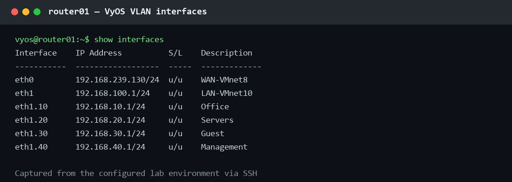
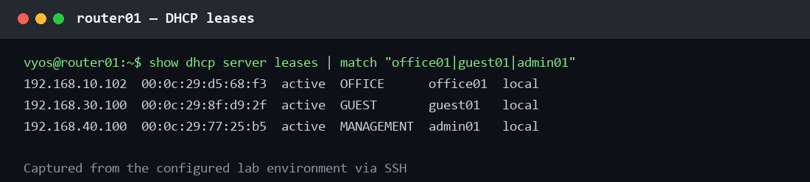
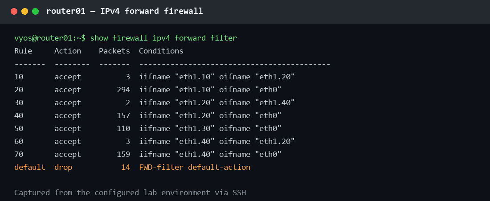
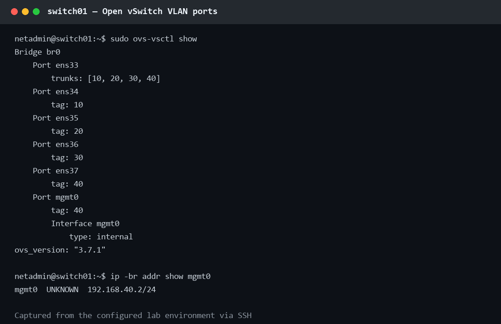
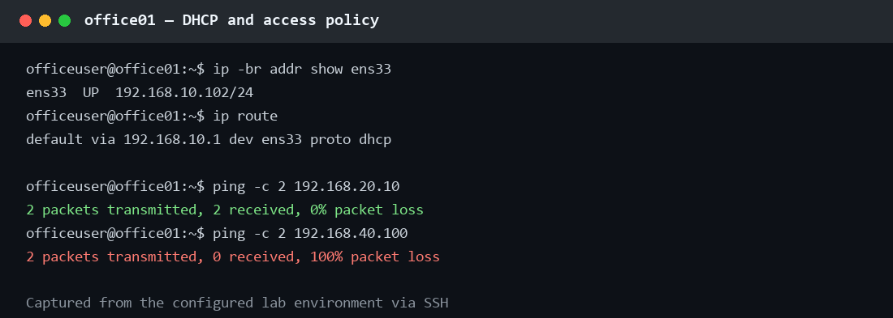
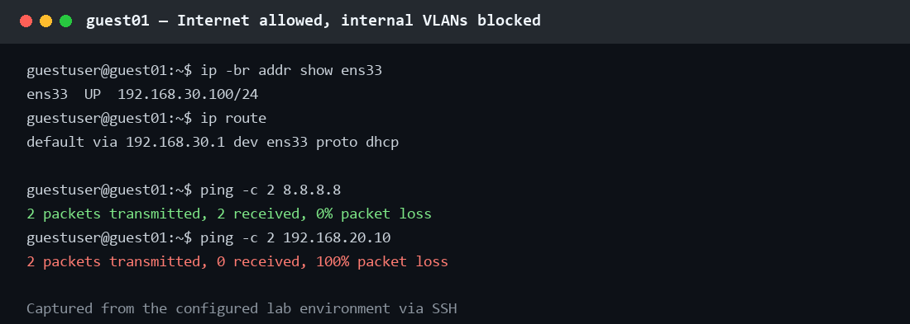
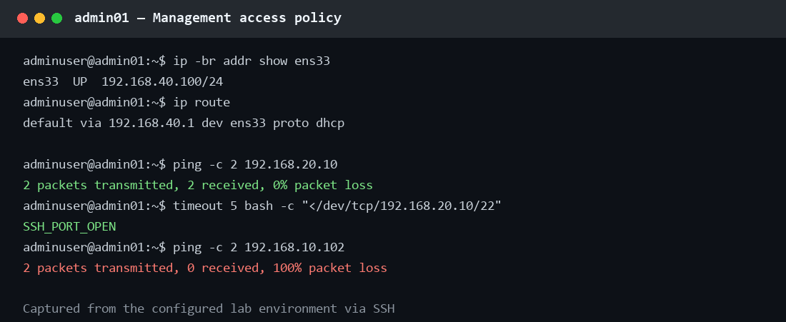

# Virtual Network Infrastructure Lab

Лабораторная работа по настройке небольшой корпоративной сети в VMware Workstation.

В проекте используются VyOS как маршрутизатор, Open vSwitch как коммутатор с VLAN и Ubuntu Server как серверы и тестовые компьютеры.

## Что я настраиваю

```text
Internet
  ↓
VMnet8 (NAT)
  ↓
router01 (VyOS)
  ↓ trunk: VLAN 10, 20, 30, 40
switch01 (Open vSwitch)
  ├─ VLAN 10: office01
  ├─ VLAN 20: server01
  ├─ VLAN 30: guest01
  └─ VLAN 40: admin01
```

## VLAN и адреса

| VLAN | Назначение | Подсеть | Шлюз |
| --- | --- | --- | --- |
| 10 | Office | `192.168.10.0/24` | `192.168.10.1` |
| 20 | Servers | `192.168.20.0/24` | `192.168.20.1` |
| 30 | Guest | `192.168.30.0/24` | `192.168.30.1` |
| 40 | Management | `192.168.40.0/24` | `192.168.40.1` |

Полный план: [docs/ip-plan.md](docs/ip-plan.md) и [docs/vlan-plan.md](docs/vlan-plan.md).
Текущие реальные проверки: [docs/evidence.md](docs/evidence.md).

## Виртуальные машины

| VM | Роль | Сеть |
| --- | --- | --- |
| `router01` | VyOS: маршрутизация, DHCP, DNS, NAT, firewall | VMnet8 + trunk VMnet10 |
| `switch01` | Open vSwitch | trunk VMnet10 + access-сети |
| `office01` | офисный компьютер | VLAN 10, DHCP |
| `server01` | сервер | VLAN 20, `192.168.20.10` |
| `guest01` | гостевой компьютер | VLAN 30, DHCP |
| `admin01` | компьютер администратора | VLAN 40, DHCP |

## Что должно работать

- Office выходит в интернет и может обращаться к Servers.
- Servers могут обращаться в Management, но не в Office.
- Guest выходит в интернет, но не видит остальные VLAN.
- Management может обращаться к Servers.
- DHCP выдаёт адреса для VLAN 10, 30 и 40.
- DNS на VyOS пересылает запросы во внешний DNS.

Правила подробнее: [docs/firewall-policy.md](docs/firewall-policy.md).

## Порядок работы

1. Установить VyOS на диск `router01`.
2. Настроить базовую сеть `192.168.100.0/24` и проверить интернет через VMnet8.
3. Создать `switch01` и нужные private VMnet для access-портов.
4. Настроить Open vSwitch и VLAN.
5. Настроить VLAN-интерфейсы, DHCP, DNS, NAT и firewall на VyOS.
6. Подключить Ubuntu VM и выполнить проверки.
7. Сохранить логи и скриншоты в `screenshots/`.

Подробные шаги: [docs/architecture.md](docs/architecture.md).

## Файлы проекта

| Папка | Содержимое |
| --- | --- |
| `vyos/` | пример конфигурации VyOS |
| `openvswitch/` | скрипт настройки OVS и systemd unit для него |
| `scripts/` | простые скрипты проверки сети и DNS |
| `docs/` | схема, план адресов, VLAN, firewall и troubleshooting |
| `screenshots/` | скриншоты готовой лабораторной |

## Полезные команды

На Linux:

```bash
ip addr
ip route
ping -c 3 192.168.10.1
ping -c 3 8.8.8.8
dig deb.debian.org
```

На VyOS:

```text
show interfaces
show ip route
show dhcp server leases
show firewall
```

На Open vSwitch:

```bash
sudo ovs-vsctl show
sudo ovs-ofctl dump-flows br0
```

## Проверки для отчёта

- [x] VyOS загружается с виртуального диска.
- [x] WAN через VMnet8 работает.
- [x] VLAN 10/20/30/40 созданы.
- [x] DHCP и DNS работают.
- [x] NAT даёт внутренним VM доступ в интернет.
- [x] Правила firewall проверены с `office01`, `server01`, `guest01` и `admin01`.
- [ ] Все сценарии из [docs/troubleshooting](docs/troubleshooting) выполнены.
- [x] В `screenshots/` добавлены терминальные скриншоты команд и результатов.

## Screenshots

Скриншоты ниже собраны из фактического вывода команд через SSH. Пароли и другие
секреты в них не попадают.

### VyOS







### Open vSwitch



### Client checks






